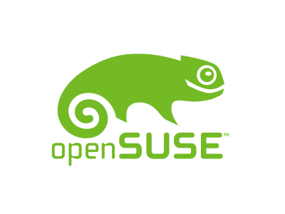

= id="overview" data-x="0" data-y="0" data-scale="5"

---
= id="this-is-not" class="big bold whats" data-x="-1000" data-y="1200" data-scale="1"
What this isn't

---
= style="font-size: 140px" data-x="-1000" data-y="1400"
Am I eligibile?

---
= style="font-size: 80px" data-x="-1000" data-y="1600"
How much will I be paid?

---
= style="font-size: 70px" data-x="-1000" data-y="1800"
Which organization should I choose?

---
= class="big bold title" data-x="-1000" data-y="2200"
RTFM

<!-- next -->
---
= class="big bold whats" id="this-is" data-x="0" data-y="1200" data-scale="1"
What this is

---
= style="font-size: 120px" data-x="0" data-y="1400"
what to expect

---
= data-x="0" data-y="1600"

writing a proposal

that's good

<!-- next -->
---
= class="big bold whats" data-x="1000" data-y="1200"
Crash course

---
= data-x="1000" data-y="1600"

Disclaimer

IANAG

---
= data-x="1000" data-y="2000"

OSS

It's all about OSS, yaw.

---
= data-x="1000" data-y="2400"

In short:

GSoC ≡ paid work on OSS

---
= class="extralight" data-x="1000" data-y="2600"
see the logic?

---
= class="big bold" style="font-size: 80px" data-x="1400" data-y="3400" data-rotate="90"
what you need to do

---
= class="todo" data-x="1200" data-y="3400" data-rotate="90"
1\. find organization

---
= class="todo" data-x="1100" data-y="3400" data-rotate="90"
2\. project proposal

---
= class="extralight" style="font-style: italic" data-x="900" data-y="3400" data-rotate="90"
Not necessarily in that order.

---
= data-x="1000" data-y="4000"
How many students will Google accept?

---
= data-x="1000" data-y="4200"
wrong question!

---
= data-x="1000" data-y="4400"
How many students can the organization support?

---
= class="big bold" style="font-size: 80px" data-x="1000" data-y="4800"
a strong proposal

---
= data-x="1000" data-y="5000"
sufficient scope/workload

---
= class="big bold" style="font-size: 94px" data-x="1000" data-y="5200"
feasible

---
= data-x="1000" data-y="5250"
within your capabilities

---
= data-x="1000" data-y="5500"
timeline

---
= data-x="1000" data-y="5600"
not exact dates

---
= data-x="1000" data-y="5700"
deliverables (code) at each stage

<!-- next -->
---
= id="my-gsoc" class="big bold whats" data-x="2000" data-y="600" data-rotate="-90"
My GSOC

---
= class="big bold whats" data-x="2400" data-y="600" data-rotate="-90"

---
= class="big bold whats" data-x="2500" data-y="600" data-rotate="-90"
CGit vs JGit

---
= data-x="2600" data-y="600" data-rotate="-90"
Histogram diff

---
= data-x="2700" data-y="600" data-rotate="-90"
interesting: malloc()'s take time!
malloc()'s one huge chunk, give it out

---
= data-x="2800" data-y="600" data-rotate="-90"
interesting: line hashes are linearized
adding a O(n^2)

---
= data-x="2900" data-y="600" data-rotate="-90"
interesting: fixed an O(m*n) ~ O(n^2) bottleneck
7s on a bad-ass xml file

---
= data-x="3000" data-y="600" data-rotate="-90"
conclusion: all code merged, though performance
room for more work
i suspect diff printing ("emit")

<!-- next -->
---
= id="shoutouts" class="big bold whats" data-x="2000" data-y="-200" data-rotate="-90"
Shoutouts

---
= data-x="2400" data-y="-200" data-rotate="-90"

---
= data-x="2800" data-y="-200" data-rotate="-90"

---
= data-x="3200" data-y="-200" data-rotate="-90"

---
= id="credits" data-x="3600" data-y="-200" data-rotate="-90" data-rotate-y="60" data-scale="5"

Credits

an <a href="http://bartaz.github.com/impress.js/">impress.js</a> presentation

Styles based on <a href="https://github.com/johnpolacek/WhatTheHeckIsResponsiveWebDesign-impressjs">What The Heck Is Responsive Web Design</a> by <a href="http://twitter.com/johnpolacek">John Polacek</a>

<a href="http://bartaz.github.com/impress.js/">impress.js</a> created by <a href="http://bartaz.github.com/">Bartek Szopka</a>

